<style>
img {
  page-break-inside: avoid;
  break-inside: avoid;
  display: block;
  margin: auto;
}
</style>

# CSCE 435 Group project

### Evaluation plan - what and how will you measure and compare

We will vary multiple parameters and will measure performance
using caliper instrumentation. For each experiment, we will take the measurements
mentioned in 6c. Our first experiment will vary data types and fix the
other parameters. For this experiment, we plan to compare sorting an integer array with a double
array. Our second experiment will vary input data sizes while fixing other parameters. We will use
2^16, 2^18, 2^20, 2^22, 2^24, 2^26, and 2^28 elements for evaluation. Our third experiment will
vary the sorting level. We will test on a sorted array, a sorted array with 1% perturbation,
a randomly generated array, and a reversely sorted array. To gauge strong scaling performance,
we will fix the input data size (likely to 2^22 elements) and use
2, 4, 8, 16, 32, 64, 128, 256, 512, and 1024 processors for evaluation. To gauge weak scaling,
we will vary the input data size as we increase the processor count. We will likely use
the following pairs:

- (2^16 elements, 16 processors)
- (2^18 elements, 32 processors)
- (2^20 elements, 64 processors)
- (2^22 elements, 128 processors)
- (2^24 elements, 256 processors)
- (2^26 elements, 512 processors)
- (2^28 elements, 1024 processors)

We will carry out these experiments for each of the sorting algorithms
and compare the performance across different input sizes / processor counts using
graphics. We will also include graphics that compare performance between algorithms.

### Caliper instrumentation

#### Bitonic Sort

```
0.661 main
├─ 0.001 comm
│  └─ 0.001 comm_large
├─ 0.096 comp
│  └─ 0.096 comp_large
│     ├─ 0.006 merge_keep_high_n
│     └─ 0.005 merge_keep_low_n
├─ 0.004 correctness_check
└─ 0.063 data_init_runtime
```

#### Radix Sort

```
0.503 main
├─ 0.000 data_init_runtime
├─ 0.000 comp
│  ├─ 0.000 comp_large
│  └─ 0.000 comp_small
├─ 0.030 comm
│  ├─ 0.029 comm_small
│  └─ 0.001 comm_large
└─ 0.000 correctness_check
```

#### Merge Sort

```
0.867 main
├─ 0.000 data_init_runtime
├─ 0.000 comp
│  ├─ 0.000 comp_small_merge_sort
│  └─ 0.000 comp_large_merge_arrays
├─ 0.032 comm
│  ├─ 0.063 comm_large_recv
│  └─ 0.000 comm_large_send
└─ 0.000 correctness_check
```

#### Sample Sort

```
0.031 main
├─ 0.029 comm
│  ├─ 0.000 comm_large
│  └─ 0.029 comm_small
├─ 0.000 comp
│  ├─ 0.000 comp_large
│  └─ 0.000 comp_small
├─ 0.000 correctness_check
└─ 0.000 data_init_runtime
```

## Performance evaluation

Include detailed analysis of computation performance, communication performance.
Include figures and explanation of your analysis.

### Vary the following parameters

For input_size's:

- 2^16, 2^18, 2^20, 2^22, 2^24,W 2^26, 2^28

For input_type's:

- Sorted, Random, Reverse sorted, 1%perturbed

MPI: num_procs:

- 2, 4, 8, 16, 32, 64, 128, 256, 512, 1024

This should result in 4x7x10=280 Caliper files for your MPI experiments.

## Presentation

Plots for the presentation should be as follows:

- For each implementation:
  - For each of comp_large, comm, and main:
    - Strong scaling plots for each input_size with lines for input_type (7 plots - 4 lines each)
    - Strong scaling speedup plot for each input_type (4 plots)
    - Weak scaling plots for each input_type (4 plots)

Analyze these plots and choose a subset to present and explain in your presentation.

### Bitonic Sort

#### Strong Scaling Plots

  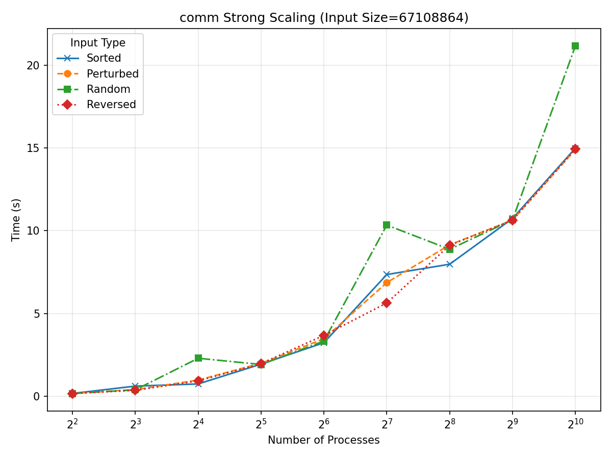 
   
  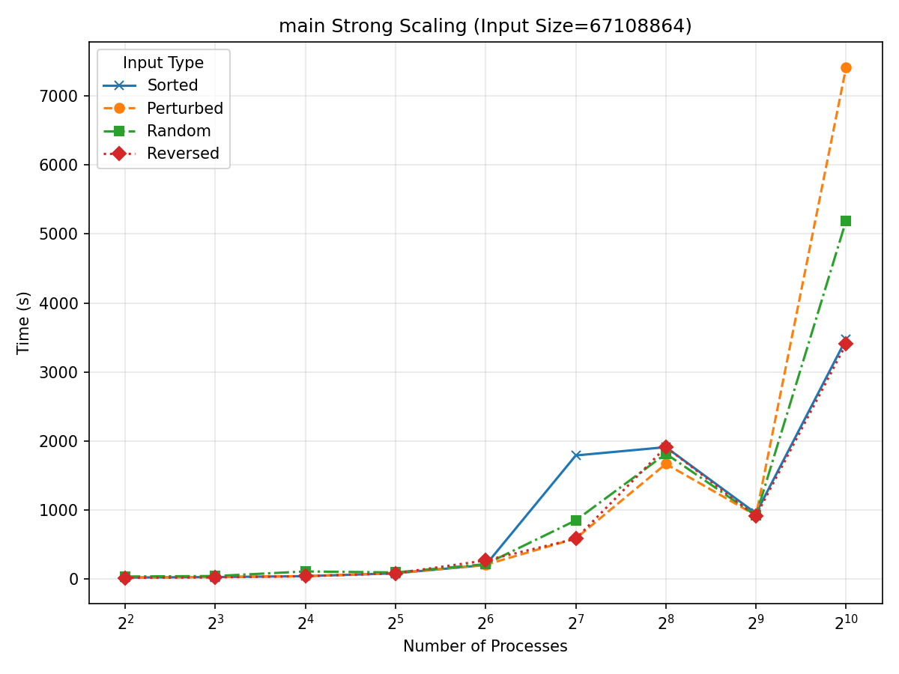

#### Strong Scaling Speedup Plots

  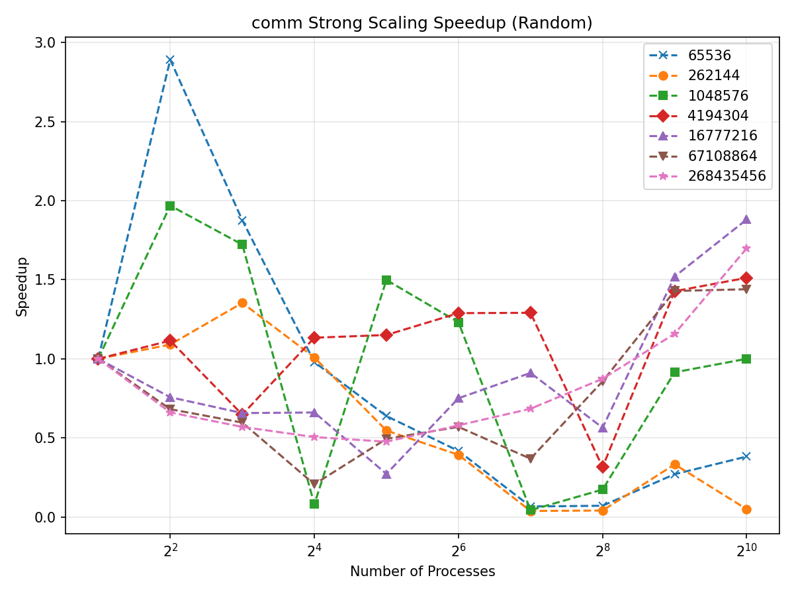 
  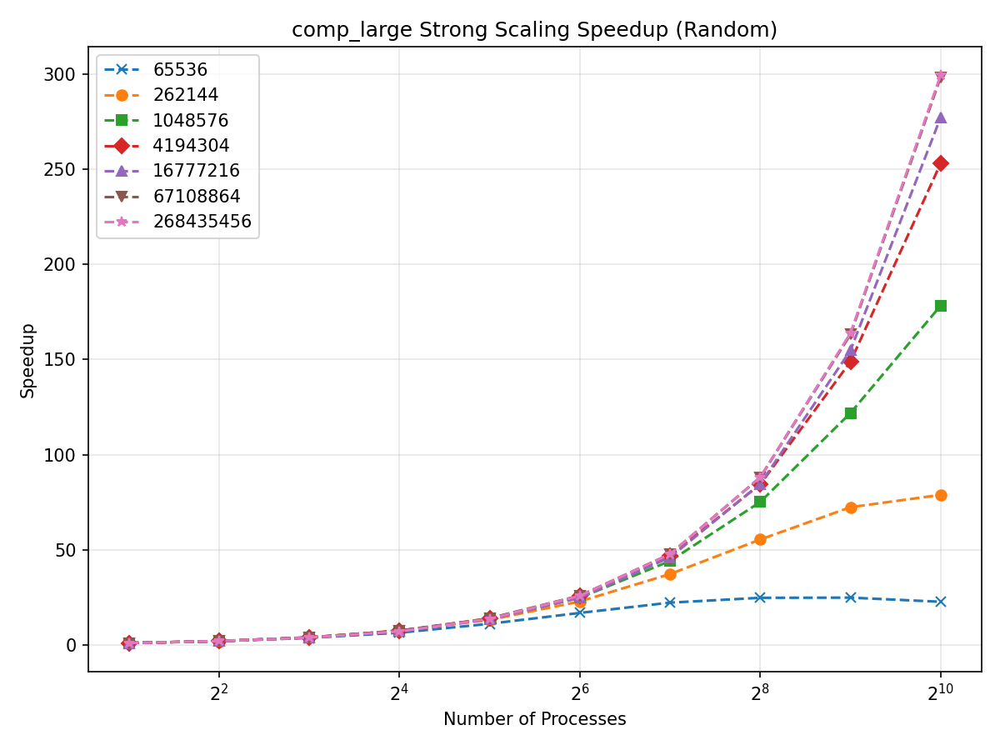 
  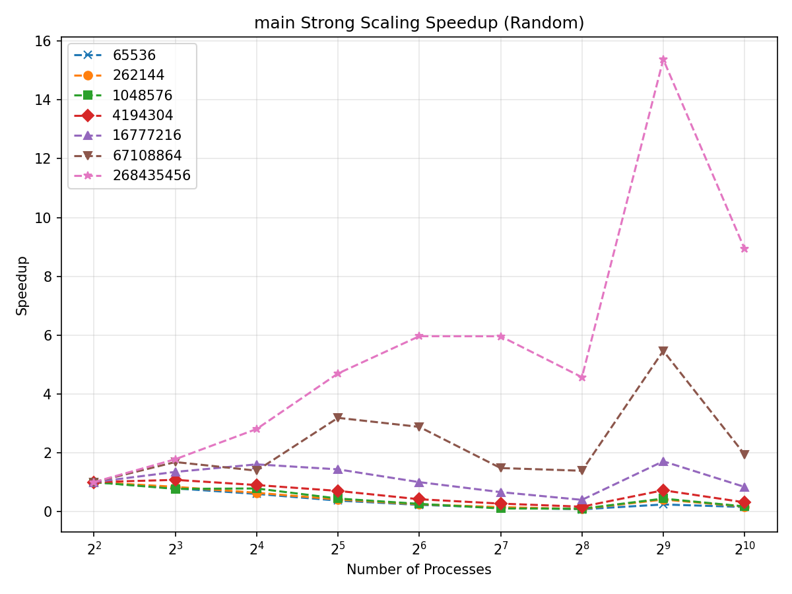

#### Weak Scaling Plots

  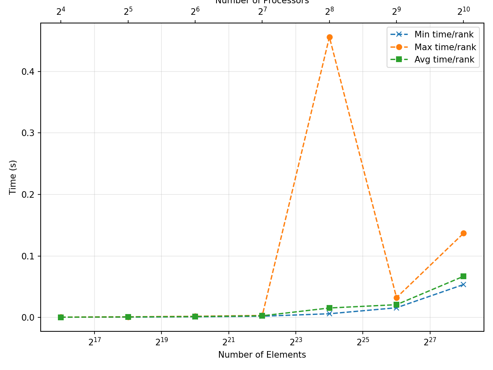 
  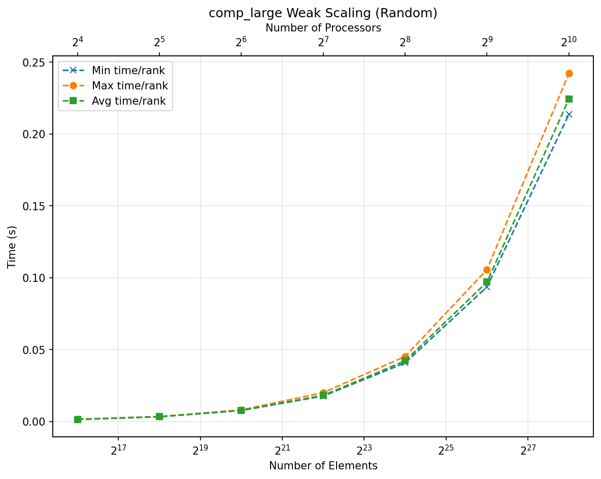 
  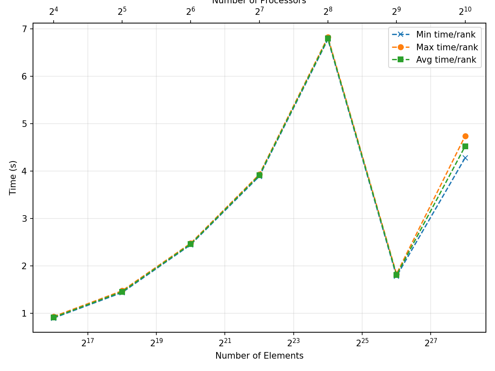

#### Analysis Bitonic Sort

What’s going on is pretty simple: the bitonic sort has a lot of communication phases. In each phase, every process sends its chunk to a partner, gets their chunk back, and then compares the two chunks to keep the half it’s supposed to keep. We do that over and over as we scale up. So even when you add more processes, each one still has to go through all of those group steps, and each step touches its whole local array. That’s why the runtime doesn’t fall off the way you’d hope when you throw more ranks at it. Once we hit around 128–256 ranks the extra stages and the busy network start to dominate and the strong scaling curves flatten or even go up. The communication plots pop at the same points, especially for random and reverse inputs, because those inputs force real data movement in the compare split instead of letting us “win” quickly. Sorted input is always the cleanest line for that reason. The main time is just comp plus comm, so it shows both effects at once. In weak scaling we still have to run all the bitonic stages as P grows, so the time drifts upward even though the local problem size stays about the same. In short, adding more processors does not inherantly increase performance. Communication between processes takes time, and with enough processors, communication between them takes longer than computation itself.

### Radix Sort

#### Strong Scaling Plots

   
  
  

#### Strong Scaling Speedup Plots

   
  
  

#### Weak Scaling Plots

   
  
  

#### Analysis Radix Sort

The speedup factor doesn’t vary much between input type (sorted, perturbed, etc.) because radix sort doesn’t have an inbuilt mechanism to check the sorting level of the array. So, each input, even if it’s already sorted, is sorted radix by radix. The communication speedup curve generally decays because increasing the number of processes causes increased communication among the processes. This is especially true for my radix sort implementation since each process could possibly send elements to every other process. Interestingly, 2^9 and above processes seem to perform well in many plots, and even have communication speedup, suggesting that grace has a more optimal resource allocation strategy after some threshold.
The large computation speedup generally increases with increased process count before hitting a plateau and decreasing. Larger input sizes seem to have increased speedup compared to smaller input sizes as indicated by sharper curves. This increased speedup can be attributed to each process having to locally sort less elements since the input size is fixed. The strong scaling plot especially supports this as increasing the process count for fixed input sizes shows a decaying exponential trend. Since part of the large computation time involves computing histograms of every process, plateaus are unsurprising since computing histograms for more processes takes longer.
The total or main speedup behaves similarly to the large computation time as it increases before hitting a plateau and decreasing. Increasing process count only seems to benefit input sizes of 2^24 and above as the other input sizes seem to mainly have negative speedup (i.e. slowdown). While the large computation speedup is as large as ~120, the total speedup is much more modest (~4). This is because increased communication costs cancel out the benefits of quicker computation, leading to more modest efficiency gains. The weak scaling plots especially support this as the main time looks like a replica of the comm time on a different scale. The strong scaling plots also show this balance quite well as the first half of the main time closely resembles a decaying computation time while the second half resembles an increased communication time. In other words, the strong scaling plot looks like the comp_large plot superimposed on the comm_time plot.

### Merge Sort

#### Strong Scaling Plots

 
 


#### Strong Scaling Speedup Plots

 
 


#### Weak Scaling Plots


#### Analysis - Merge Sort

For comm strong scaling, increasing the number of processor means more communication being done by each processor. As we increase the number of processors, we start by sending and reciving smaller arrays which cascade into sending larger and reciving larger arrays. This could be causing the increase in communication, because we have large amounts of processors sending and reciving larger and larger arrays. The dropoff at the end could be due to merge sort working best when the number of processors is large, such that each processor is getting small enough arrays so that its very quick initally to send and recives before it starts to getting to sending larger arrays, where it starts to slow down. This make sense since with less processors we spend more time in comp_large, but as we spend less time in comp_large, we are limited by the communcation between processors. The reason our comp_large drops at 1024 processors, but our comm also drops, could be because our array sizes are so small, that it takes very little time to merge and to send.
For comp large strong scaling, we are measure the time it takes to merge arrays. Since we increase the processor count, each sorted array for each processor gets smaller, so we are merging smaller sorted arrays, which takes less time as we increase the processor count. Each processor starts with the smaller array, so merging initially is quite fast.Our main has a similar shape to our comp_large, illustrating that our comp_large mostly domiantes the main function. Comp large seems to scale well with all input sizes and input types, which makes sense since each processor is getting a smaller array to merge together as we increase the processor count. Our comm seems to scale well with only large input sizes, which tells us that only with large input sizes are we able to give each processor enough work to do, and send data efficiently. Because of this, our comm domiantes the main speed up, since comm is only scaling well with large input sizes. Our comp_large max is really high since we are reciving and sending larger and larger arrays as we increase processor count. Eventually, a rank will be sending/reciving a large array, which increase the amount of time that rank spends merging. The min and avg are low since we start with small arrays that we merge and build up to larger arrays, and most of the processors end up working with the smaller arrays. For comm we again see the dropoff for 1024 processors at a large input size, which tells us that we are only scaling well with large input sizes and large amounts of processors. Which again could be that each array is small enough such that merging does not take long, and the array is small enough so that sending does not take long. The communication increase makes sense. Our main is mostly dominated by our comm for large input sizes and large processor counts

### Sample Sort

#### Strong Scaling Plots

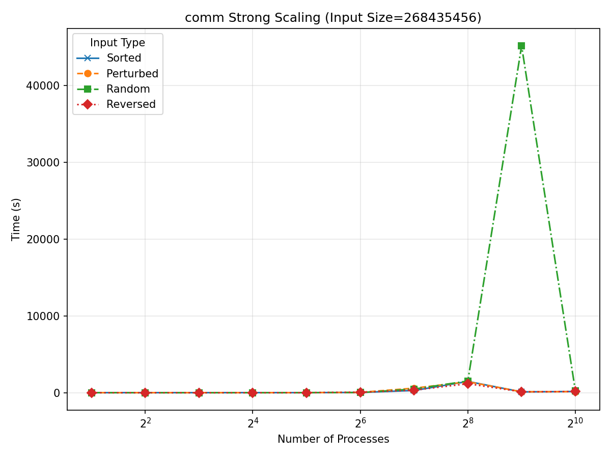
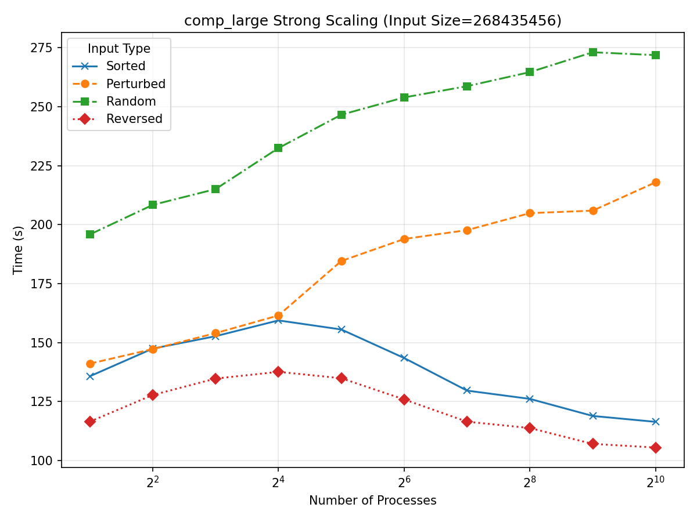
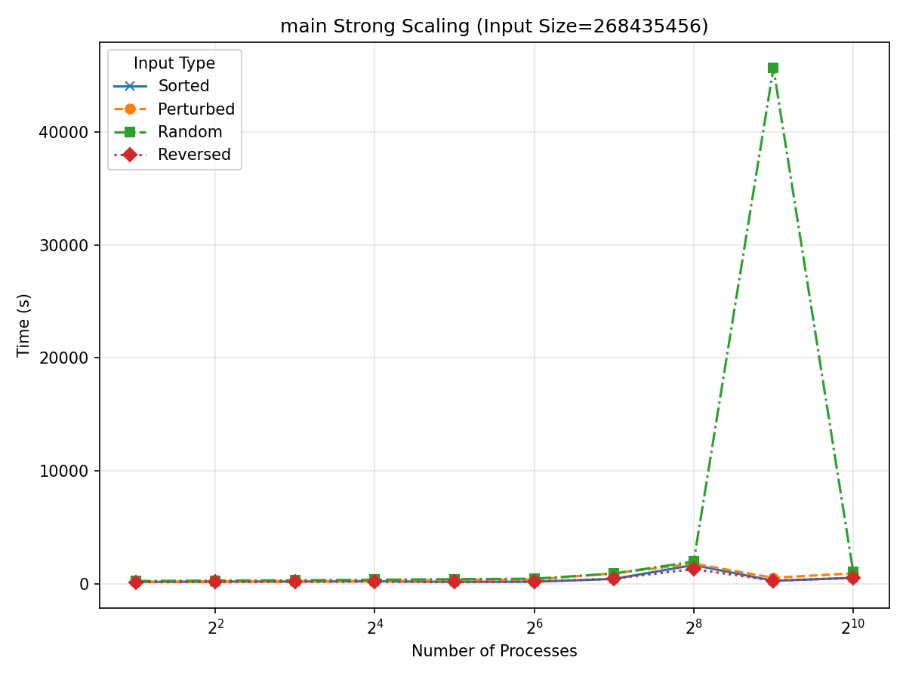

#### Strong Scaling Speedup Plots

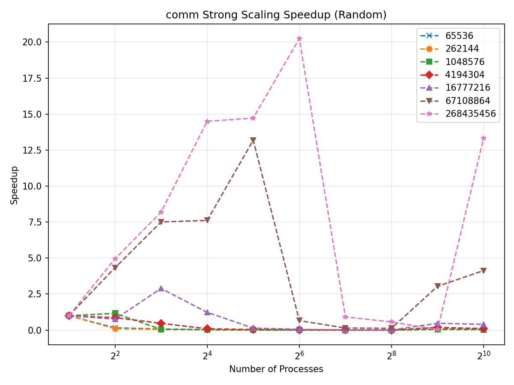
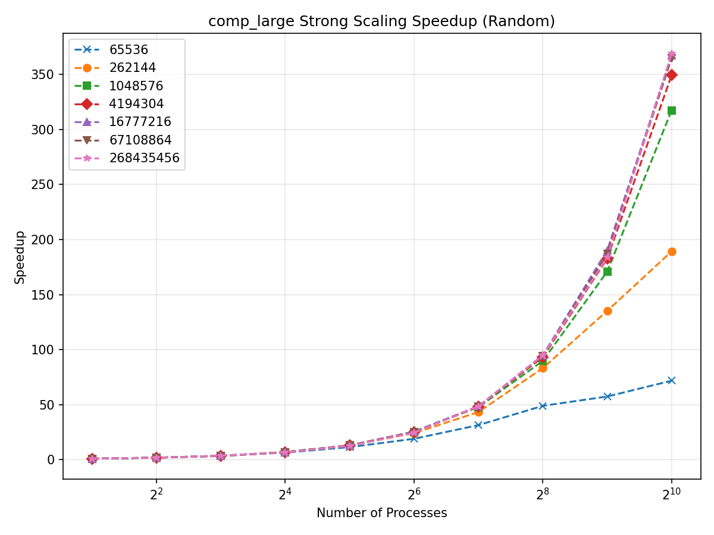 
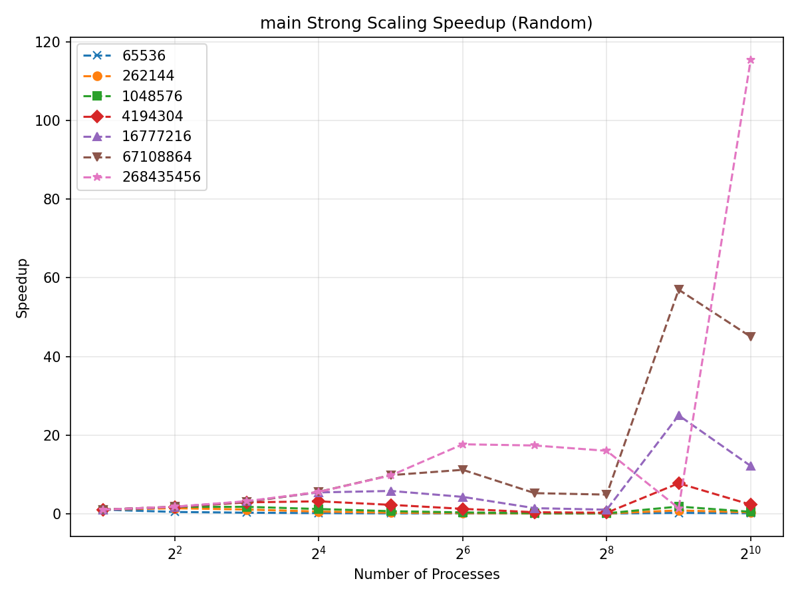

#### Weak Scaling Plots

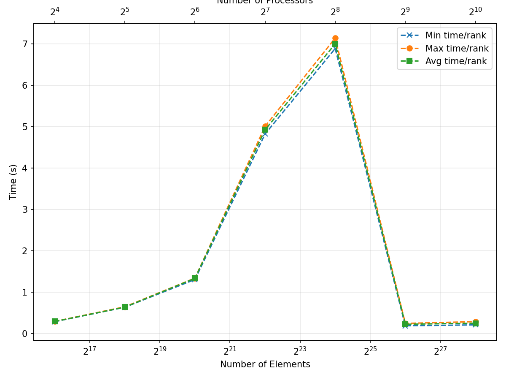
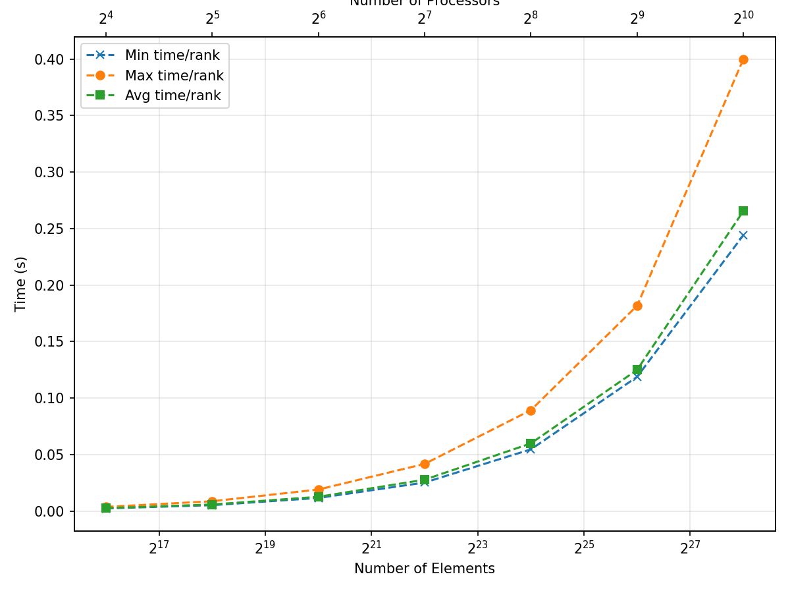
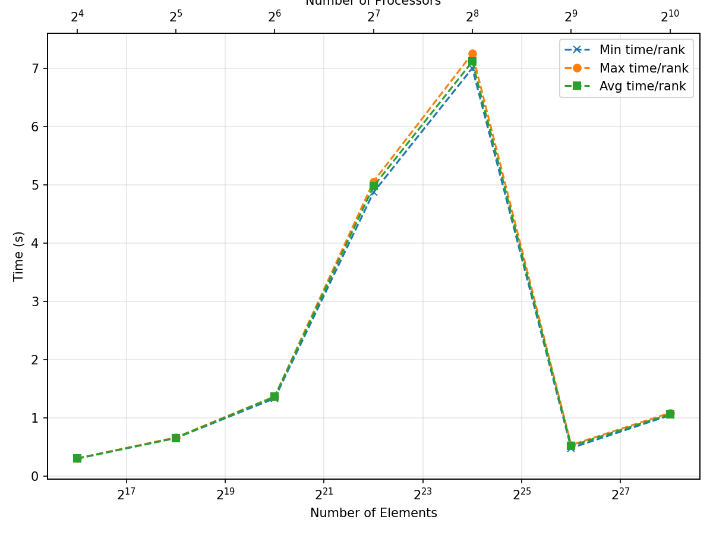

#### Analysis - Sample Sort

Looking at the strong scaling performance in Sample Sort, follows an upward trend with high irregularity, particularly for the random input case. Most input types (sorted, perturbed, reversed) remain relatively stable across increasing processor counts, but random input spikes dramatically near 256 processors before dropping sharply at around 512 and 1024 processors. This behavior can be caused by load imbalance and communication bottlenecks triggered by uneven partitioning in the local data for each processor. With random input, samples are not uniformly distributed across buckets, leading to heavy communication overheads during the Alltoallv redistribution. The comp_small exhibits a more predictable behavior trend, which increases as the processor count increases, which indicates that that there is a degradation of computational efficiency due to uneven data distribution presumably by poor splitter selection. This behavior is shared with the main input type, which suggests that the load imbalance is the main bottleneck in the sorting algorithm. When looking at main, it seems to indicate that the communication overhead is the main bottleneck in this algorithm.
Looking at the weak scaling graphs, starting with comp_large, the time increases nearly linearly as both problem size and processor count grows. This is expected behavior as each rank must handle a proportionally similar local problem, which its local sorting cost grows as the array size grows. The main phase shows behavior consistent with the combination of both rising overall runtime with increasing scale but without major outliers. The lack of severe spikes suggests that weak scaling mitigates imbalance issues, as each rank's data size grows uniformly. This is especially apparent in the sorted and reversed respectively.
Looking at the Strong Scaling Speedup graph, starting with the comm speedup, the plot shows that communication efficiency varies drastically across input sizes, which presumably reflects the network contention and nonuniform workload balance under random partitioning, where small changes in the splitter distribution can drastically affect which ranks communicate most heavily. On te other hand, comp_large speedup is nearly ideal, as we increase the number of processors, speedup grows exponentially across all input sizes. This reflects that the local sort operation is close to being embarassingly parallel, which each processor gets to sort a smaller subset of a bigger array straight off the bat, decreasing nearly perfectly with additional processor. The main speedup graph is the middle ground. The graph suggests that while computation scales well, communication dominates the total runtime at scale, limiting the total efficiency of the algorithm.

### Comparisons

#### Strong Scaling Plots

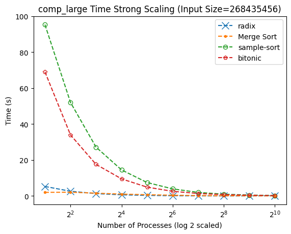
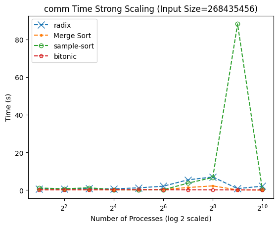
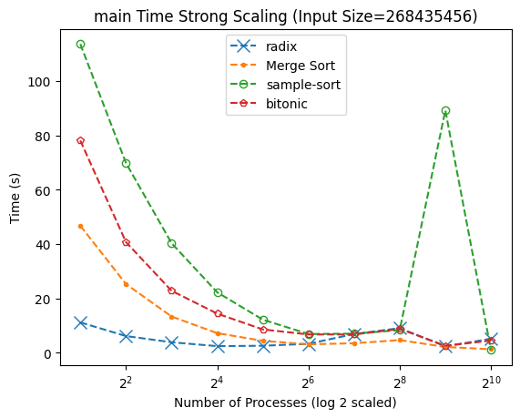

#### Strong Scaling Speedup Plots

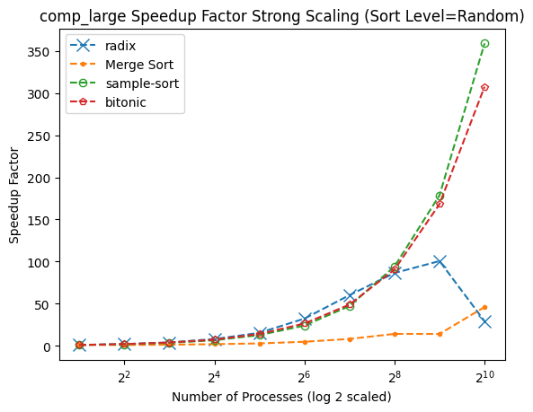
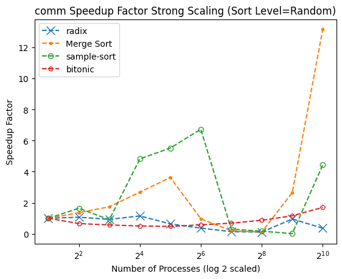
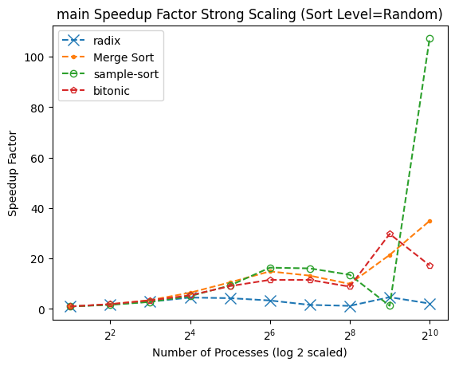

#### Weak Scaling Plots

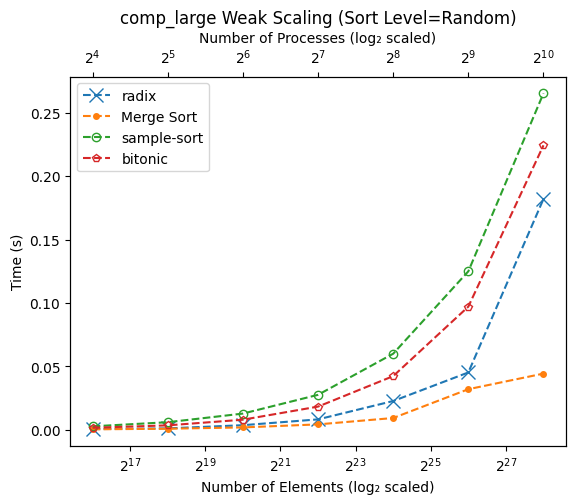
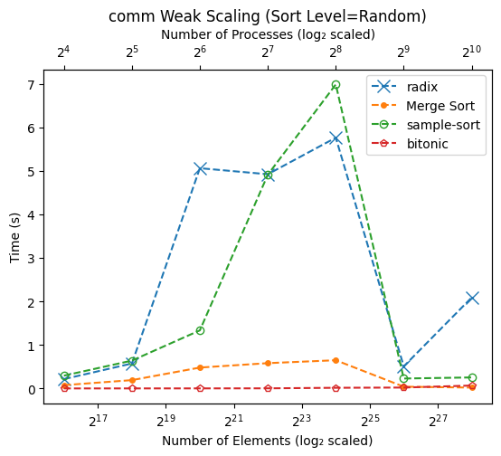
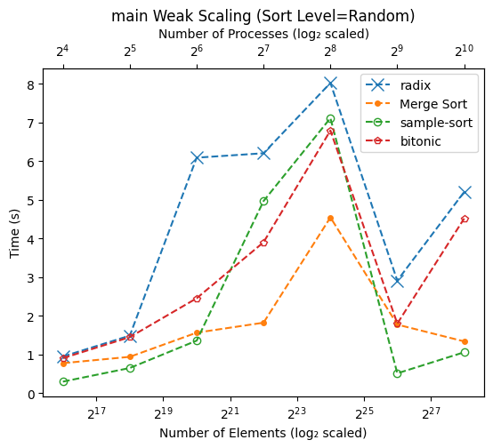

## 8. Final Report

Submit a zip named `TeamX.zip` where `X` is your team number. The zip should contain the following files:

- Algorithms: Directory of source code of your algorithms.
- Data: All `.cali` files used to generate the plots separated by algorithm/implementation.
- Jupyter notebook: The Jupyter notebook(s) used to generate the plots for the report.
- Report.md
